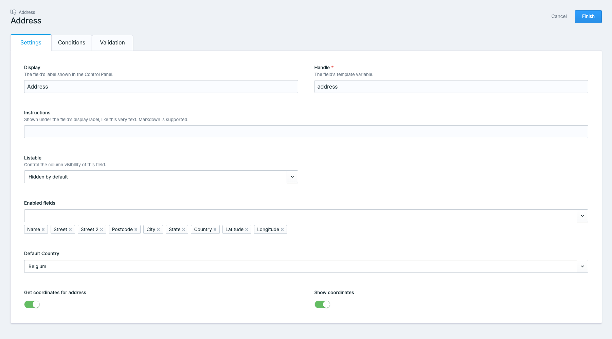
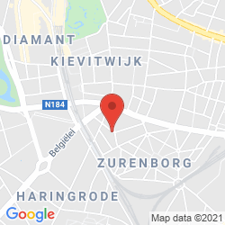

## Installation

1. Install Statamic Address Field from the `Tools > Addons` section of your control panel, or via composer:

```shell
composer require rias/statamic-address-field
```

2. You can publish the configuration file using

```shell
php artisan vendor:publish --tag=statamic-address-field-config
```

## Configuration

### Geocoding

This addon uses [OpenStreetMaps Nominatim](https://wiki.openstreetmap.org/wiki/Nominatim) as its geocoding service.

### Google Maps API

To enable static map rendering and custom marker placement, you need to provide a Google Maps API key.

1. Sign in to [Google's developers console](http://console.developers.google.com/)
2. Create a new project
3. Enable the `Google Static Maps API`
4. Set the API key in your `.env` file as `GOOGLE_MAPS_API_KEY`

#### Other configuration

The config file also allows you to set some extra defaults:

- Default map styling (options are silver, retro, dark, night or aubergine)
- Default marker color 
- Default marker icon

## Usage

### Antlers tag

The addon provides an Antlers tag `{{ address }}` which allows you to access most of the functionality.

#### `{{ address:countries }}`

This tag allows you to loop over all available countries, which can be useful for displaying certain data.

```antlers
{{ address:countries }}
    {{ name }} <!-- Belgium -->
    {{ display }} <!-- "Belgium" when locale is set to "EN", "België" when locale is set to "NL" -->
    {{ name }} <!-- BE -->
    {{ alpha2 }} <!-- BEL -->
    {{ numeric }} <!-- 056 -->
    {{ currency }}
        {{ value }} <!-- EUR, countries can have more than one currency -->
    {{ /currency }}
{{ /address:countries }}
```

### Fieldtype

This addon comes with a fieldtype that allows users to enter a full address. The fieldtype itself is configurable in which fields are shown to the user:



Available configuration:
- enabledFields:
  - name
  - street
  - street2
  - postCode
  - city
  - state
  - country
  - latitude
  - longitude

- defaultCountry
  - In `alpha2` notation

- geoCode
  - Whether to geocode the address to lat/lng coordinates `true`/`false`
- showCoordinates
  - Whether to show the latitude & longitude fields `true`/`false`

### Displaying a static map

You can display a static map using the `{{ address:staticMap }}` tag.

#### Parameters

| Parameter | Description                                                  | Default           |
|-----------|--------------------------------------------------------------|-------------------|
| `address`   | The address data from the fieldtype                          | `null` (required) |
| `zoom`      | How zoomed in the map should be                              | `14`              |
| `width`     | The width of the image in px                                 | `640`             |
| `height`    | The height of the image in px                                | `640`             |
| `style`     | A style key that is defined in the `map_styles` config value | `default`         |
| `color`     | The color of the marker that is shown on the map             | `null` (optional) |
| `icon`      | A URL to a custom marker icon                                | `null` (optional) |
| `scale`     | The scale of the map                                         | `1`               |

#### Example

The following static map will be generated for the Spatie HQ address:
```antlers
{{ address:staticMap :address="address" width="250" height="250" }}
```



#### Just the URL

If you need just the URL to the map image, you can call `staticMapUrl` instead, which will output the url.

```antlers
{{ address:staticMapUrl :address="address" width="250" height="250" }}
```

### Dynamic map

You can also display a dynamic embedded map using the tag.

```antlers
{{ address:map :address="address" width="250" height="250" }}
```

#### Parameters

The `q`, `origin` & `destination` parameters will be set depending on the `type` of map, you can still override them manually as well.

| Parameter | Description                                                                                    | Default           |
|-----------|------------------------------------------------------------------------------------------------|-------------------|
| address   | The address data from the fieldtype                                                            | `null` (required) |
| type      | The type of embedded map, can be one of `place`, `directions`, `view`, `streetview`, `search`  | `place`           |
| maptype   | The tiles to load, can be one of `roadmap` or `satellite`                                      | `roadmap`         |
| zoom      | The map zoom                                                                                   | `14`              |

For more information, and all available parameters depending on `type` you can view [https://developers.google.com/maps/documentation/embed/embedding-map](https://developers.google.com/maps/documentation/embed/embedding-map)

### Directions url

You can generate a directions url that links to the address by calling:

```antlers
{{ address:directions :address="address" :currentLocation="true" }}
```

`currentLocation` is optional and defaults to `true`.
