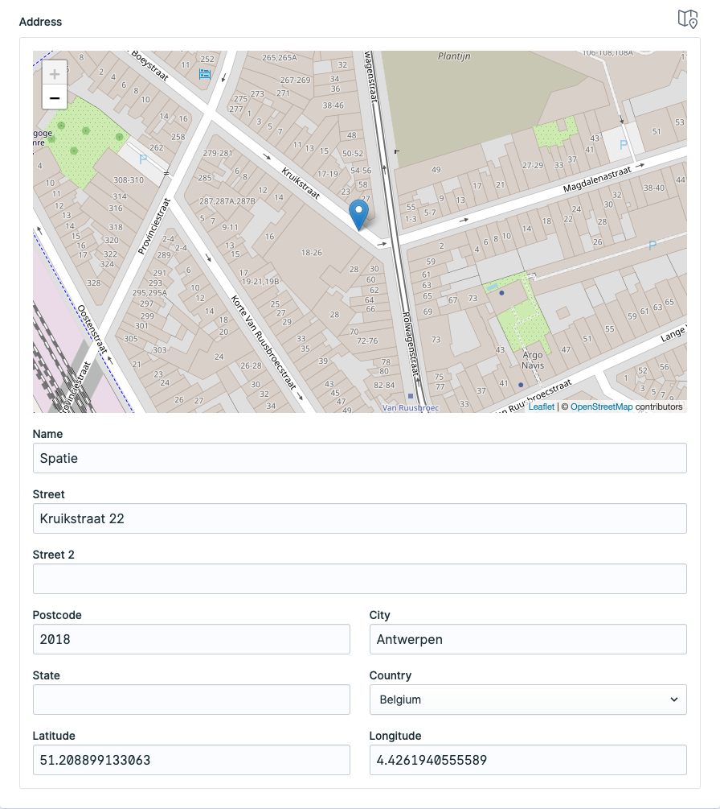

# Statamic Address Field

This addon provides a full-featured address field for Statamic.



- Each field can be turned on or off
- Geolocation of the address
- Users can drag the marker to the exact location of the address
- Render static maps
- Render embedded maps
- Get direction URLs

And more! Check out the [Documentation](https://statamic.com/addons/rias/address-field/docs)

## License

Address Field requires a license to be used while on a production site.  
You can purchase one at https://statamic.com/marketplace/addons/rias/address-field.

You may use Address Field without a license while developing locally.

## Installation

Require it using Composer.

```
composer require rias/statamic-address-field
```

Publish the assets:

```
php artisan vendor:publish --provider="Rias\StatamicAddressField\ServiceProvider"
```

Brought to you by [Rias](https://rias.be)
